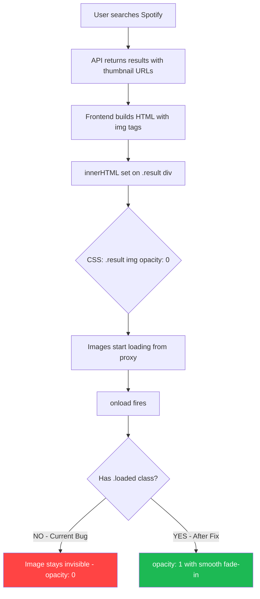

# Fix: Spotify Search Thumbnail Not Displaying

## Root Cause Analysis

### Primary Bug: CSS `opacity: 0` without `.loaded` class

The **progressive image loading** CSS in [`style.css`](public/style.css:1234) sets ALL images inside `.result` to `opacity: 0` by default:

```css
/* Line 1234-1244 in style.css */
.result img,
.search-result-item img {
  opacity: 0;
  transition: opacity 0.3s ease-in;
}

.result img.loaded,
.search-result-item img.loaded {
  opacity: 1;
}
```

Images only become visible when the `.loaded` CSS class is added to the `` element. 

**The Spotify search handler** in [`handleSpotifySearch()`](public/script.js:398) uses an inline `onload` that only logs to the console - it **never adds the `.loaded` class**:

```javascript
// Line 398-401 in script.js - BROKEN

```

**Compare with YouTube search** in [`script.js`](public/script.js:209) which correctly adds the `.loaded` class after innerHTML is set:

```javascript
// Line 209-217 in script.js - WORKING
document.querySelectorAll('.search-result-item img').forEach(img => {
  img.addEventListener('load', function () {
    this.classList.add('loaded');
  });
  if (img.complete) {
    img.classList.add('loaded');
  }
});
```

### Why `onload` fires but image is invisible

```
Sequence of events:
1. innerHTML is set with  tags
2. Browser starts loading images from /api/spotify-proxy
3. Proxy fetches from Spotify CDN and returns image data
4. Browser receives image → onload fires → "Loaded:" logged to console
5. BUT: .result img { opacity: 0 } keeps the image invisible
6. .loaded class is never added → opacity remains 0
```

### Secondary Bug: Detail card image issues

The [`selectSpotifyTrack()`](public/script.js:456) function has two additional issues:

1. **No `.loaded` class** - The detail card image also starts at `opacity: 0` and never gets the class
2. **Uses raw Spotify CDN URL** - The `thumbnail` parameter is the raw `i.scdn.co` URL, not proxied through `/api/spotify-proxy`, which could cause CORS issues

```javascript
// Line 456 in script.js - BROKEN

// Should be: src="/api/spotify-proxy?url=${encodeURIComponent(thumbnail)}"
```

---

## Fix Plan

### Fix 1: Add `.loaded` class handlers in `handleSpotifySearch()`

**File:** [`public/script.js`](public/script.js:422) - After `resultDiv.innerHTML = html;`

Add image load handlers identical to what YouTube search uses:

```javascript
// After line 423: resultDiv.style.display = 'block';
// Add loaded class for progressive image loading
document.querySelectorAll('.spotify-result-item img').forEach(img => {
  img.addEventListener('load', function () {
    this.classList.add('loaded');
  });
  img.addEventListener('error', function () {
    // On error, replace with fallback emoji
    this.parentElement.innerHTML = '<div style="width:100%;height:100%;display:flex;align-items:center;justify-content:center;font-size:24px;background:linear-gradient(135deg,#1DB954,#191414);">🎵</div>';
  });
  // For cached images that load immediately
  if (img.complete) {
    img.classList.add('loaded');
  }
});
```

Also update the inline `onload` in the HTML template to add the class directly as a safety belt:

```javascript
// Line 399 - update onload handler
onload="this.classList.add('loaded');"
```

### Fix 2: Fix detail card image in `selectSpotifyTrack()`

**File:** [`public/script.js`](public/script.js:451)

1. Use proxied URL for the image source
2. Add `.loaded` class handler after innerHTML

```javascript
// Line 456 - use proxied URL
const proxiedThumb = thumbnail ? `/api/spotify-proxy?url=${encodeURIComponent(thumbnail)}` : '';
// In innerHTML:

```

After innerHTML, add load handler:

```javascript
const detailImg = resultDiv.querySelector('.spotify-detail-card img');
if (detailImg) {
  detailImg.addEventListener('load', function() {
    this.classList.add('loaded');
  });
  if (detailImg.complete) {
    detailImg.classList.add('loaded');
  }
}
```

### Fix 3: Clean up inline event handlers

Remove the debug `console.log` and `console.error` inline handlers from the Spotify image template since we will use proper `.addEventListener()` calls instead.

---

## Files to Modify

| File | Changes |
|------|---------|
| [`public/script.js`](public/script.js) | Fix `handleSpotifySearch()` and `selectSpotifyTrack()` - add `.loaded` class handlers |
| [`api/spotify-proxy.js`](api/spotify-proxy.js) | No changes needed - proxy is working correctly |
| [`public/style.css`](public/style.css) | No changes needed - the progressive loading CSS is correct by design |
| [`lib/spotify.js`](lib/spotify.js) | No changes needed - API wrapper is returning correct data |

---

## Visual Flow



## Summary

The bug is a **missing CSS class** issue, not a proxy or API issue. The progressive image loading system requires `.loaded` to be added to images after they finish loading. YouTube and Pinterest search results do this correctly, but the Spotify search handler was missing this step. The fix is straightforward: add `.loaded` class event handlers after `innerHTML` is set, matching the pattern used by other search features.
